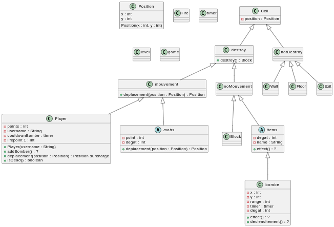
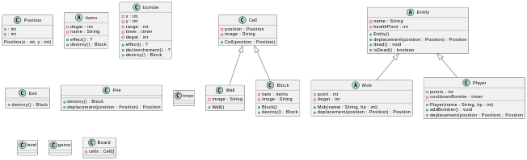

# Rapport 6 : 
#### Madeline
- Null Pattern
- Clean code
- Message sends are hooks for subclasses
- Pas de duplication
- Emmental -> les sous classes doivent remplir les trous
- Utiliser les patterns au bon moment
- polymorphise

#### Elisa
- Rappels double dispatch
- Bonnes techniques de code / refractoring
- Bonnes utilisations des patterns pour simplifier le code
- Travail sur notre projet

#### Rabah
- Refresh double dispatch
- Les envois de messages
- Polymorphise
- Design pattern
- Travail sur le projet de Bomberman

#### Projet 
- On a choisi de faire un bomberman
- On a travaillé sur une conception de projet
- Nous sommes toujours à la recherche de notre conception idéale pour pouvoir démarrer le projet correctement
- Nous avons écrit différents UML à travers plusieurs réflexions de conception

Voici le lien de notre projet Bomberman : 

On a fais un premier UML qui ne fonctionne pas :
   

Et voici l'UML que nous trouvons mieux :  

Pour le moment nous nous concentrons principalement sur les cases et sur la manière dont on représente le plateaux on verra par la suite le reste, nous essayons de réfléchir au mieux au code pour trouver des design pattern comme demandé. 
