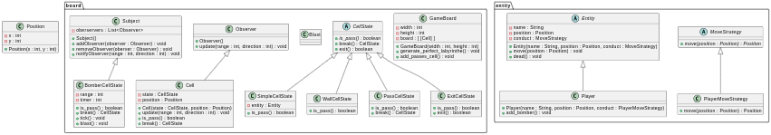

# Rapport 8
#### Madeline
 - **Composite**
 - Element simple et composé sont polymorphique
 - Il y a un composant/feuille et des composés, on a une liste de composés
 - Moins modulable que le visiteur

 - **Visiteur**
 - Il fontionne très bien avec le composite
 - Permet de "vister" un objet pour étendre une structure de donnée
 - Ajout et modification de fonctionnalité, plus facile et rapide qu'avec le composite

#### Elisa
- Rappel du composite
- Explication du visiteur
- Le composite est moins modulable que le visiteur
  - Pour ajouter une fonctionnalité dans le composite, il faut ajouter une méthode dans chaque sous classe ou la classe mère
  - Alors que dans le visiteur, il faut créer une nouvelle classe qui impléémente visit_ avec les types de notre structure de données
- L'ajout et la modification de fonctionnalités est ainsi plus facile et plus rapide avec un visiteur

#### Rabah
- Polymorphique, Élément simple et composé.
- Comprend un composant/feuille et des composés.
- Le visiteur Permet d'élargir une structure de données en "visitant" un objet.
- L'ajout et la modification de fonctionnalités sont plus simples avec le visiteur.
- Il suffit de créer une nouvelle classe implémentant la méthode "visit_" pour chaque type de la structure de données.

#### Projet
 - Fais depot git
 - Se répartir les tâches
 - Commencer à coder
Nous avons encore une fois mis à jour l'UML : 

