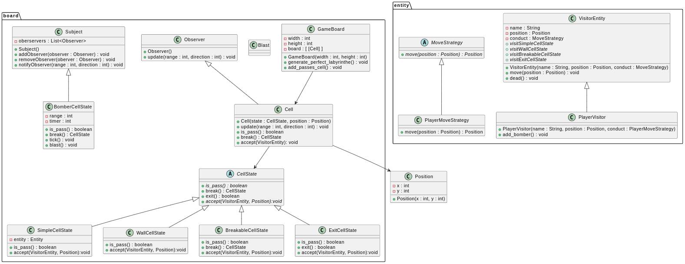

# Rapport 10

#### Madeline
 - Design Pattern Strategy
 - *Sous-Typage :  Permet d'heriter d'un objet pour être un. Definis un sous type, tout ce qui est compatible avec la super classe et compatible avec la sous classe. POur la spécialisation*
 - *Sous-classage : Permet d'herité afin de récupérer les méthodes de la super classe, on peut annuler des méthodes. Pour la réutilisation*
 - *Polymorphisme :  capacite des 2 objets à être interchangeable pour un client*
 - Partage
 - Extensibilité
 - Granularité du partage

#### Elisa
- Découverte du design pattern Strategy
- Différence entre sous-typage et sous-classage
  - sous-typage : c'est de la spécialisation
  - sous-classage : c'est de la réutilisation
- Etude de l'exam 1 et questions sur les mauvaises réponses
  - Attention, le polymorphisme peut exister sans héritage (c'est simplement une capacité d'interchanger des objets)
- Travail sur le projet  

#### Rabah
- Absence entreprise
  
#### Projet
- Implémentation du design pattern State
  - Modification des class existantes
  - Adaptation des méthodes
  - Adaptation des tests
- IHM mise à jour, plus ouverte à l'évolution
- Plateau implémenté d'une différente manière => On peut accéder aux cases du plateau
- Ajout d'un controleur et d'un main
- Mise à jour de l'uml qui combine le visiteur de la semaine dernière avec le state
 
