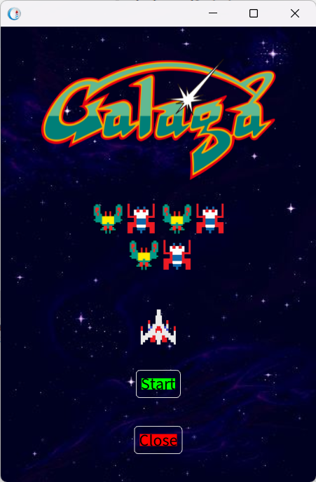
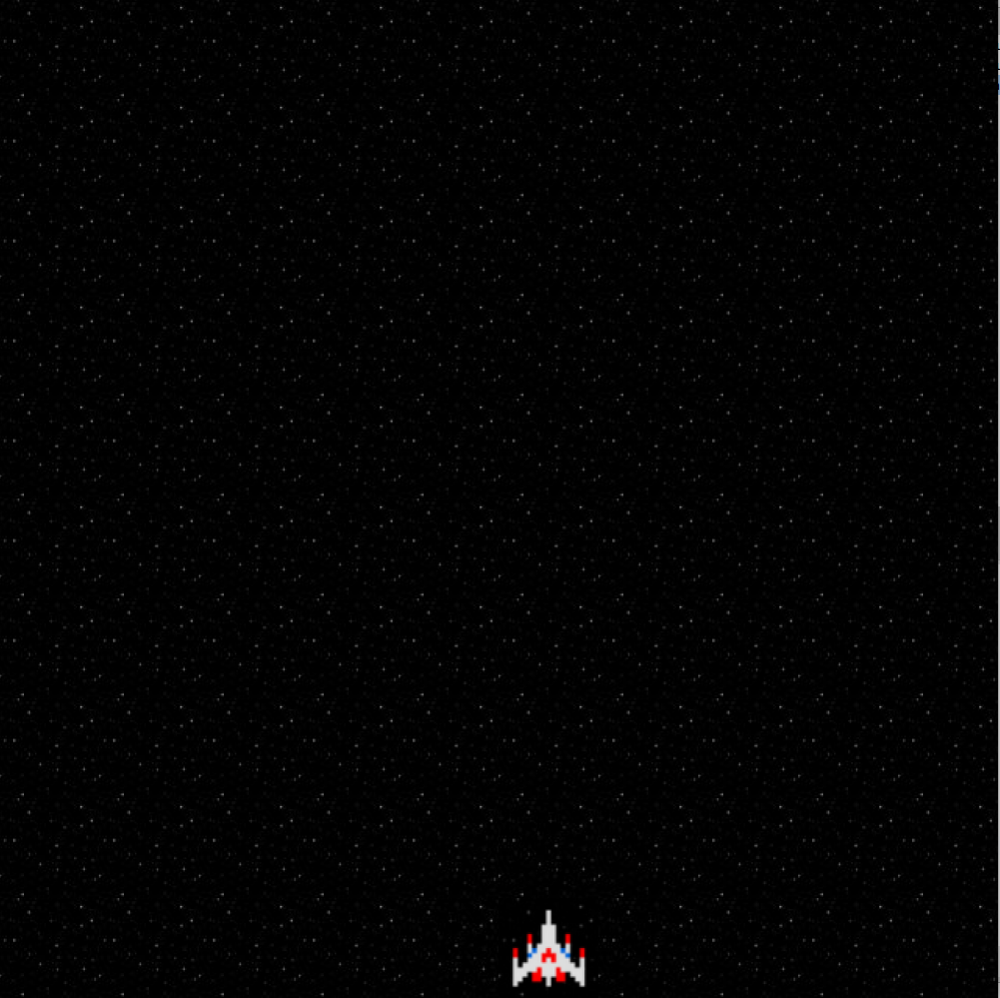

# Semaine 10

## Abdellatif

### What I could achieve

- Coded first page of the game, the page is sort of gateway to the game, normally it should have stuff like best score and last attempt score. But we won't have them for the moment.
- The interesting i did was that **I changed the background of [the window](#img) to an image**, I this by making first the background using canva, then i exported it to a string encoded in base64, and then I passed it as a Form in the `background:` method. The way we bind symboles to icons got me inspired.
- One other thing I did was messing with BlLayouts to have the perfect front-end look.

### What I couldn't achieve

- Change the color of the text to the one I want. I could only have the background image.

    

## Skander

Pendant cette séance, nous avons poursuivi notre travail sur le projet, réalisant notamment une interface graphique comprenant plusieurs cases représentant le vaisseau spatial et l'espace.
Nous avons enrichi le projet en introduisant de nouvelles classes telles que MygGalaBoxElement et MygGalaElement.

### Difficultés rencontrées
Nous avons fait face à des défis pour obtenir un affichage correct des images dans chaque case, en particulier avec des images de taille inférieure à celle des cases. De plus, nous avons rencontré des problèmes lors de la tentative d'affichage de plusieurs lignes de cases. Ces obstacles ont constitué des points de complexité auxquels nous avons dû faire face au cours de cette phase du projet.

### Ce que j'ai appris
Au cours de cette séance, j'ai acquis une compréhension approfondie du fonctionnement de l'affichage des cases en explorant des projets existants. J'ai saisi comment les objets représentant les éléments du jeu, tels que MygGalaPlayer, sont liés à leur affichage dans la fenêtre graphique. Les fonctionnalités implementors et senders se sont avérées précieuses pour parcourir les classes des anciens projets et les comprendre. Cette expérience a renforcé ma maîtrise des liens entre la logique du jeu et son rendu visuel dans le contexte de notre projet.
 

    

