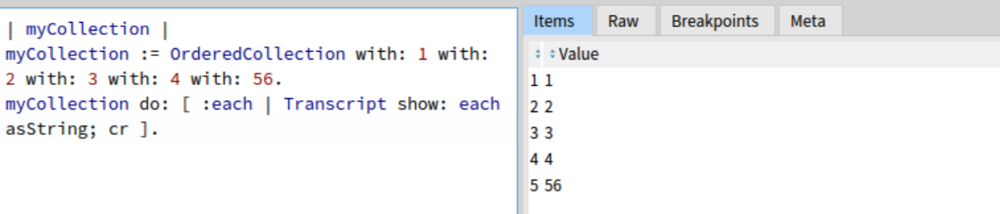
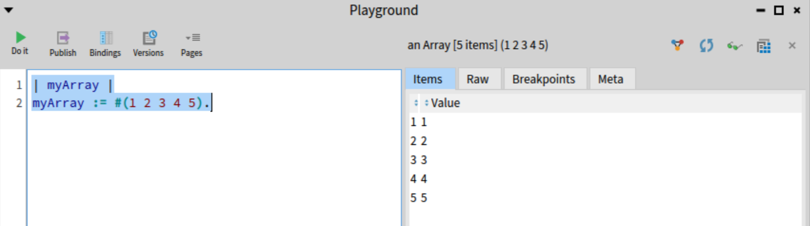
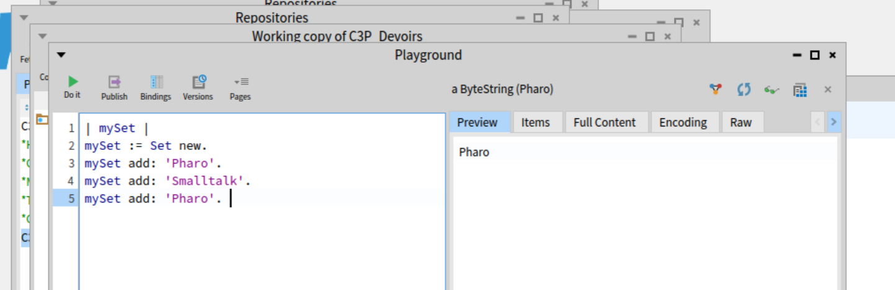
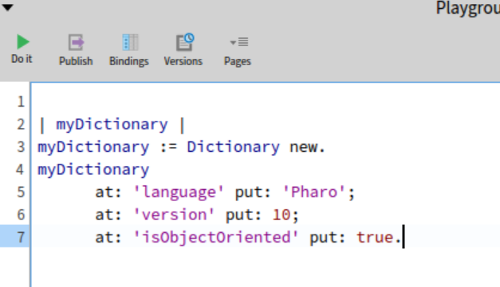
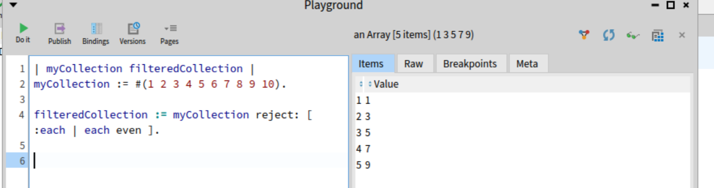
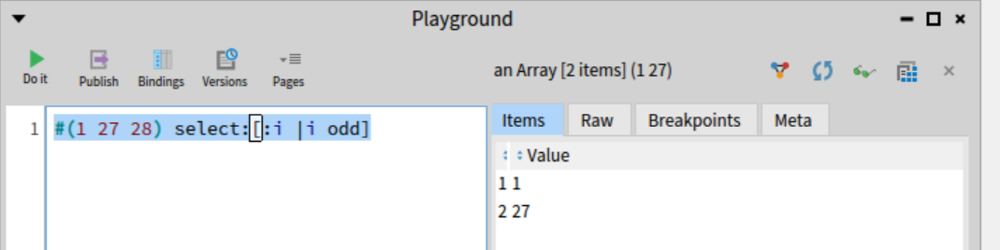
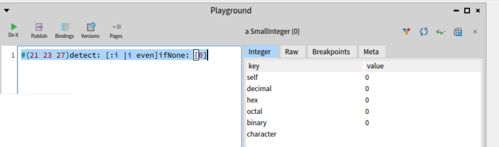
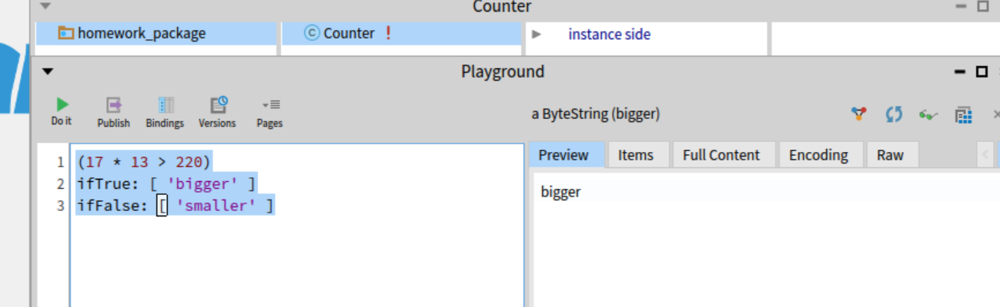
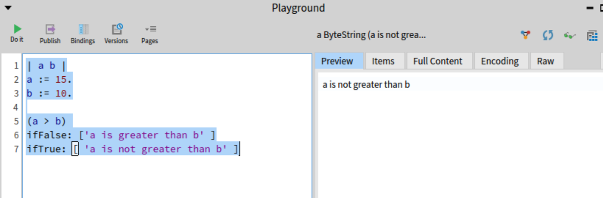

## Rapport des activités de maisons à preparer

### - Partie Wagnan SORO

> ### _What is a collection and what is it used for?_
> une collection est une classe qui hérite de Collection ou d'une de ses sous-classes, et qui permet de gérer un groupe d'éléments. Les collections dans Pharo sont polymorphes, ce qui signifie qu'elles partagent une interface commune, et peuvent donc être manipulées de manière uniforme

> ### _What kind of collections does Pharo standard library provide?_
> #### _OrderedCollection_
> est une collection dynamique qui permet d'ajouter et de supprimer des éléments tout en préservant l'ordre d'insertion.
> #### _Array_
> collection de taille fixe, on accède aux elements par des indices.
> #### _set_
> collection que ne permet pas les redondances. 
> #### _Dictionary_
> table de hachage, sous forme de clé valeurs.

>### _How do you iterate collections and what are differences between them?_
>On peut itérer les elements d'une collection de plusieurs façons, on note :
> * `reject` :  Eliminer les elements de la collection qui sont pairs
> * `do` : Exécute une action pour chaque élément de la collection          . Ne retourne pas de nouvelle collection.
> * `select` :  Renvoie une nouvelle collection avec les éléments qui répondent au critère donné.
> * `detect`: Détecter le premier element qui repond à un critère

>### _How did you find this information?_
> J'ai trouvé les infos dans le MOOC sur youtube et dans les cours de la L3

>### _How do you write conditionals in Pharo?_
> ifTrue: , ifFalse:, ifTrue:ifFalse:
> 
> 

>### _What is different from other programming languages?_
> Avec le langage java par exemple, on a des différences qui sont que
En Java, la syntaxe if utilise des parenthèses pour délimiter la condition et des accolades {} pour délimiter les blocs de code à exécuter.
En Pharo, la condition est suivie directement par des messages ifTrue: et ifFalse:, qui sont des méthodes envoyées à l'objet condition.
Java est un langage orienté objet avec une syntaxe héritée du C. La structure de contrôle if-else est une construction syntaxique de base.
Pharo est un langage purement orienté objet basé sur Smalltalk, et même les contrôles de flux comme ifTrue: et ifFalse: sont des messages envoyés à des objets,ce qui reflète la nature uniforme et orientée message du langage.

>### _Can you think about the benefits and drawbacks of the approach?_
> En Java, la syntaxe if utilise des parenthèses pour délimiter la condition et des accolades {} pour délimiter les blocs de code à exécuter.
    En Pharo, la condition est suivie directement par des messages ifTrue: et ifFalse:, qui sont des méthodes envoyées à l'objet condition.
    Java est un langage orienté objet avec une syntaxe héritée du C. La structure de contrôle if-else est une construction syntaxique de base.
    Pharo est un langage purement orienté objet basé sur Smalltalk, et même les contrôles de flux comme ifTrue: et ifFalse: sont des messages envoyés à des objets,ce qui reflète la nature uniforme et orientée message du langage.

>### _How did you find this information?_
> Dans les leçons disponibles en ligne sur github

>### _How do you write a small program with classes and methods in Pharo?_
> un exemple de class et méthodes ce trouve dans ce depôt
> il s'agit d'une classe representant un dé à 6 faces
> https://github.com/marik27/C3P_Devoirs

## _How did you find this information?_
> Ayant bien compris le mode de fonctionnement de l'écriture des classes et méthodes en pharo, j'ai choi un exemple que j'ai décidé d'implémenter.

>### _Pharo methods are usually small and readable.What rules are common to follow? Are there tools that show you violations to such rules?_
> * Les règles communes à suivre : 
> Chaque méthode doit avoir une seule responsabilité ou fonction. Cela facilite la compréhension et la maintenance du code.
 Méthodes Courtes, Noms de Méthodes Descriptifs, Pas Trop de Paramètres , Pas de Code dupliqué, Utilisation de Messages Simples dans les méthodes.
> * Pour voir ses violations, on peut par exemple utiliser `CriticBrowser` : Un outil intégré à Pharo qui permet de vérifier le code en fonction de diverses règles de style et de bonnes pratiques.

### - Partie Ouassila BOUKHARS


>#### What is a collection and what is it used for?What kind of collections does Pharo standard library provide?How do you iterate collections and what are differences between them? How did you find this information?

>Collection are data structures that can store object ex: array, set, dictionary ...
Collections that pharo library provides are : Sequenceable Collection, HashedCollections , Bag ...
To iterate use  iterate methods : do: (iterates on each elements), collect:(iterate and collect results) , select: (select matching elements), detect: (get first element matching), reject: (reject matching elements), detect:ifNone: (get first element matching or a default
value), includes (test inclusion).
I find these informations on the lectures on Pharo module 0


>#### Learn about conditionals in Pharo

>#### How do you write conditionals in Pharo? What is different from other programming languages? Can you think about the benefits and drawbacks of the approach? How did you find this information?

>Conditionals  are written this way : ifTrue:/ifFalse:ifTrue:/ifTrue:ifFalse:/ifFalse:
In pharo, we dont use If.. else
The drawback there  is the new way of writing conditionals.
I find this info on the MOOC


>#### Learn how to create classes and methods

>#### How do you write a small program with classes and methods in Pharo?Pharo is indeed, very IDE oriented and you have to get used to the tooling.How did you find this information?
>#### What program did you write? What problems did you find? Please provide a github repository link.


>Through the system browse you can create a class and define the  methods and tests. This information come from the Github of the lecture.
I write a small code conververtisseurFahrenheit which converts from degrees Celsius to Fahrenheit.
I encounter problem with the git repository, in fact it need a token to create allowed the access.

>Here is the repository link : https://github.com/ouassilaBkrs/C3P-pharo

>#### Learn about the basic Pharo coding style.

>#### Pharo methods are usually small and readable.What rules are common to follow? Are there tools that show you violations to such rules?

>By default a method returns the receiver, Methods are public, use descriptives names.
I search for tools that that show violations  but  couldn't find.


> ### - Partie Ikimath ADEOYE
>> ### _What is a collection and what is it used for?_

A collection is data structure that allow to store , retrieve and manipulate groups of objects. The difference between all the collections is that some are unordered like: Dictionnary and Set which means that the objects are stored without any specific order and some are Sequenceable like orderedCollection and Array.

> ### _What kind of collections does Pharo standard library provide? And How to iterate them?_

**Dictionnary**: it's a collection of elements that associate a key object with a value object.
It's possible to iterate over all of the values, keys, and associations of a Dictionary using
the Dictionary>>#valuesDo:, Dictionary>>#keysDo:, and Dictionary>>#associationsDo: selectors. These selectors evaluate a block for
each of the items. The Dictionary>>#select: selector is also implemented to return a subset of the Dictionary where the block evaluates to true using the value.

**Array**: It's a fixed-sized collection of elements accessed by integer indices. To iterate an Array, we use _do:_, _collect:_, _select:_, _reject:_,_detect:_.

**OrderedCollection**: It's used to store an unknow amount of objects. It stores data  inside an array and remembers the first and last index. To iterate an OrderedCollection, we use _do:_, _collect:_, _select:_, _reject:_,_detect:_.


**Set**: Repreesents a set of objects without duplicates. To iteraate a Set, we use  _do:_ and _collect:_ and maybe _select:_, _reject:_,_detect:_, but I didn't see their implementation in the Set class.


My answers are based on Pharo Mooc and Comments on classes on pharo.
>

#### How do you write conditionals in Pharo? What is different from other programming languages? Can you think about the benefits and drawbacks of the approach? How did you find this information?

In pharo, to write a condition we use , _ifTrue:ifFalse_ or _ifTrue:_  or  _ifFalse:ifTrue:_ or _ifFalse:_. These messages are sent to Booleans objets True/False.

```
Example: 
    x:=5.
    y:=3.
    result:= (y>x) ifTrue[x]ifFalse:[y].

```
In my opinion, it's much more easier to proceed  like this than having to write  if..Else or Else If. But because it's not very familiar to everybody ssome people might find it difficult  or strange.

My information are baaased on previous experience with pharo and pharo Mooc.


#### What program did you write? What problems did you find? Please provide a github repository link.

I wwrote a small code to implement a calculator that ccan calculateee the sum and the average of a collection. Here is my repository: https://github.com/IkiAde/M1_MIAGE

>#### Pharo methods are usually small and readable.What rules are common to follow? Are there tools that show you violations to such rules?

Some rules to follow while coding in pharo:
- Single Responsibility Principle (SRP):Each method should perform a single task or responsibility.
- The Naming convention for classes, methods, variable
- The code formatting
- Write Good comments, do not paraphrase the code.