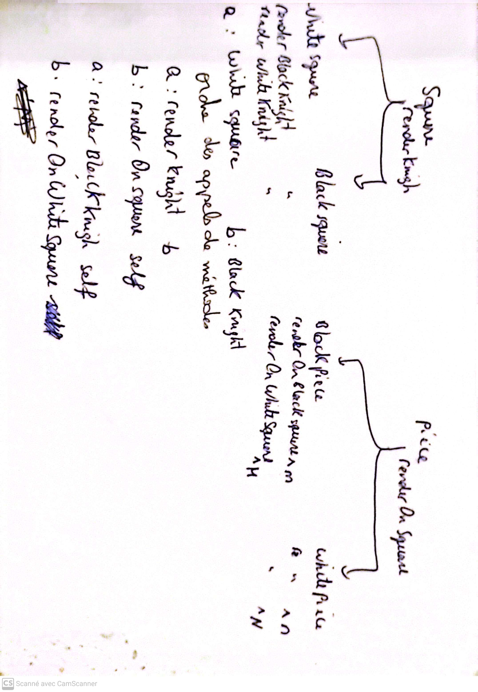

### Meryem EL KOURAICHI

## tests 

Le package Myg-Chess-Tests vérifie les méthodes du package Myg-Chess-Core et couvre 47,03 % des différents cas de test. Ce taux de couverture est insuffisant, surtout étant donné la complexité du jeu d'échecs, qui comporte de nombreux scénarios et possibilités. Il est donc essentiel d'augmenter ce pourcentage avant de commencer le kata de refactoring que j'ai choisi, afin d'assurer une base solide pour les améliorations à venir.

Dans le package Myg-Chess-Core, 80 méthodes ne sont pas entièrement testées, et 4 le sont partiellemen

La méthode que j'ai choisi de tester est la méthode render, vu que cette méthode est en lien avec le KATA que j'ai choisi. 

si j'éxecute :

``` 
testCases := { MyChessSquareTest }. 
methodToMutate := { MyChessSquare >> #renderKnight: }.
analysis := MTAnalysis new
 testClasses: testCases;
 methodsToMutate: methodToMutate. 
analysis run. 
analysis generalResult. 
```
resutat de l'exécution  :

 `22 mutants, 22 killed, 0 alive. Mutation Score: 100%.`

Ainsi 100% de mutants tués. 

J'ai fait la même opération pour toutes les pièces jusqu'à obtention d'un score complet de 100%.


J'ai aussi réalisé quelques tests pour les méthodes de la classe MyChessSquare.

Mon test coverage est actuellement à 45,30% . Je dois alors tester davantage le comportement de la classe MyChessSquare,avant de passer à d'autres classes.


## Kata 
Cette semaine j'ai pris le temps de bien comprendre ce qui est demandé pour le kata refactoring et penser à modéliser une solution tout en trouvant une réponse aux questions dans le sujet tels que : </br>

    - Can you do an implementation with double dispatch?
    - Can you do an implementation with table dispatch?

Après avoir fait un schéma ( voir ci-dessous) et déroulé les appels de méthodes dans le contexte du double dispatch, ma réponse aux questions ci-dessus est non. Le double dispatch et le table dispatch ne sont pas adaptés à cette problématique car on sera obligé à créer plusieurs classes comme une classe abstraite pour le square et puis 2 classes qui en hérite whiteSquare et blackSquare. Mais le vrai problème c'est par rapport aux 6 pièces du jeu d'échecs, il faudra créer pour chaque type de pièce : 1 classe abstraite et 2 sous classes une pour chaque couleur (par exemple whiteKnight et blackKnight). Ce qui est en fait beaucoup de classes. 
Je pense donc qu'un autre design pattern sera plus adapté , je pense actuellement au décorateur , mais je ne suis pas encore entièrement sure . J'attends de voir le cours des design pattern pour être fixé.

Voici mon schéma de brainstorming : </br>



