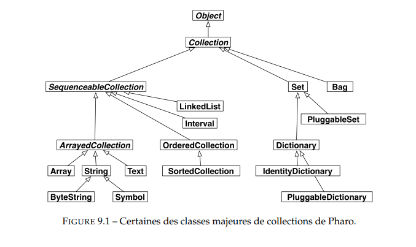
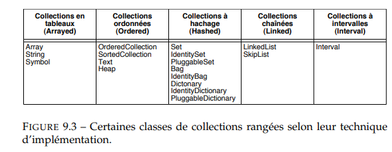

## DASSI-Helyana

# FIRST WEEK :

## HOMEWORK : 

### Pharo and their iterators

#### 1) What is a collection and what is it used for? What kind of collections does Pharo standard library provide? How do you iterate collections and what are the differences between them?

Il existe **deux types de collections** : les collections **littérales** et les collections **dynamiques**.

- Une **collection** est un ensemble d'éléments (qui peuvent être de n'importe quel type d'objet). 
- Les **index des collections** commencent à 1.

Il y a plusieurs types de collections :

- **OrderedCollection** : ( dynamique et grossit quand on add des élements)
- **Array** : (taille fixe, on accède aux élements à l'aide de leur indice)
- **Set** : (sans doublons)
- **Dictionary** : (clé-valeur)

Les collections en Pharo partagent une API commune Ils ont une api commune facilitant le vie du programmeur repartir en 7 points :

1. **Création des collections** 
2. **Accès aux propriétés** (ex : taille)
3. **Tester** (ex : savoir si la collection est vide ou non)
4. **Ajout d'éléments**
5. **Retrait d'éléments**
6. **Énumération** (ex : je veux savoir si un élement est présent)
7. **Conversion** (d'un type à un autre)

On peut créer une collection ex que j'ai testé avec une tableau de taille 2: 
dans le playground j'ai ecris : 

myTab := Array new: 2.
myTab at: 1 put: 'a'.
myTab at: 2 put: 'b'.

ensuite jai affiché mon tab :
Transcript show: myTab; cr.

Ce qui me crée un tableau de taille 2 avec les valeurs null et je l'affecte dans myTab.

info trouvé dans cette vidéo :
https://www.youtube.com/watch?v=RCEizZ5h6Dg

#### Itération de collection : 
La méthode 
- do: prend un argument qui applique a chaque élément de la collection.
- collect: transformer chaque élément 
- select: permet de filtrer les éléments
- reject: permet d'exclure certains éléments
- detect: trouver le premier élément qui correspond à une condition

**Source :** 
https://eng.libretexts.org/Bookshelves/Computer_Science/Programming_Languages/Book%3A_Pharo_by_Example_5.0_(Ducasse_Zagidulin_Hess_and_Chloupis)/11%3A_Collections/11.05%3A_Collection_Iterators


### Conditionals in Pharo
2) How do you write conditionals in Pharo? What is different from other programming languages? Can you think about the benefits and drawbacks of the approach? How did you find this information?


"A la place de la structure de contrôle conditionnelle si-alors-sinon (if(condition)), Smalltalk envoie des messages comme ifTrue: à des objets de la classe Boolean." 
 
on envoie directement des messages à des objets pour qu'ils exécutent du code en fonction de la condition

Donc se n'est pas fixe, il n'y a pas une contition précise comme dans les autres langages donc flexible car tout objet rep a ces messages.


J'ai essayé de tester avec le playground mais j'avais oublié un '.' ça ne fonctionnait pas. 
|n|
n := 4. 
n < 1 
	ifTrue: [ 'le nb est plus petit que 1' ] 
	ifFalse: [ 'le nb est plus grand que 1' ]

    "Les nouvelles (sous-)classes sont créées en envoyant un message à leur superclasse."  source au lien en dessous  
https://programmation.developpez.com/tutoriel/cours-complet-pharo/?page=chapitre-3-moins-un-resume-de-la-syntaxe#L3-6


### Classes and methods

How do you write a small program with classes and methods in Pharo? Pharo is indeed, very IDE oriented and you have to get used to the tooling. How did you find this information?

What program did you write? What problems did you find? Please provide a github repository link.

Pour commencer je me suis inspirer de ce qu'on avait fais en classe avec la class Counter, j'ai ajouté un getter, setter à ma classe LesAnimaux et ensuite créer une methode de test. 
J'ai essaye de créer une méthode pour vérifier si l'animal passé en parametre est un chat mais je rencontre un probleme car il est ecrit message envoyé mais pas implémenter?
isCat: a
    a equals: 'Cat'
        ifTrue: [ 'Cest un chat' ]
        ifFalse: [ 'Ce n'est pas un chat' ]
https://github.com/helyanay/HomeworkC3P/tree/master/src


### Learn about the basic Pharo coding style.
Pharo methods are usually small and readable. What rules are common to follow? Are there tools that show you violations to such rules?

- les méthodes doivent avoir une responsabilité unique
- les classes commencent par une majuscule
- les méthodes par une minuscule

Il faut que le code soit lisible.


### Cascades

 L'envoie de messages en cascade permet d'envoyer plusieurs messages à un même objet, séparés par des ;
 

https://programmation.developpez.com/tutoriel/cours-complet-pharo/?page=chapitre-3-moins-un-resume-de-la-syntaxe


### Problème rencontré + Aide

J'ai rencontré un problème lors d'un push sur Git, où un souci d'identification persistait malgré l'entrée correcte de mes identifiants. Après avoir cherché sur Internet, j'ai découvert qu'il fallait créer un token pour résoudre le problème. 
Mes camarades ont également eu le même souci, et nous avons pu en discuter et le régler ensemble.

J'ai aussi rencontré un autre problème avec l'utilisation du logiciel **Pharo**, mais une de mes camarades m'a aidé à le résoudre via un appel sur **Discord**.

J'ai également envoyé un mail au professeur pour résoudre un autre problème sur le tp my counter.


## EL MANSOURI Yacine

# FIRST WEEK :

## HOMEWORK : 

### Learn about collections in Pharo and their iterators

**What is a collection and what is it used for? What kind of collections does Pharo standard library provide? How do you iterate collections and what are differences between them? How did you find this information?**

Une collection est un type de données qui permet de regrouper et manipuler plusieurs objets sous une même entité. Elles sont utilisées pour stocker, organiser et gérer des ensembles de données. 
La bibliotheque standard Pharo en fournit pas mal, voici une image les resumants :  
  
Il en existe differente sorte, les séquentielles, les triées, les indexéees, les collections à clés, les collections mutables, les collections extensibles, les collections à duplicat, les collections heterogenes...
Voici un autre tableau classants les plus connus :
  
L'iteration sur une collection peut se faire de differentes facon :
do: (iterate)
collect: (iterate and collect results)
select: (select matching elements)
reject: (reject matching elements)
detect: (get first element matching)
detect:ifNone: (get first element matching or a default
value)
includes: (test inclusion)
...

Quelques exemples de code que j'ai essayé: 
`#(16 11 68 19) do: [ :each | Transcript show: each ; cr ]`
`#(16 11 68 19) select: [ :i | i odd ]`
`#(16 11 68 19) reject: [ :i | i odd ]`
...

Source : http://rmod-pharo-mooc.lille.inria.fr/Books/01-PharoByExample/PharoByExample-2011-FR.pdf  
http://rmod-pharo-mooc.lille.inria.fr/MOOC/PharoMOOC/Week3/C019-W3S09-Iterators.pdf

### Learn about conditionals in Pharo

**How do you write conditionals in Pharo? What is different from other programming languages? Can you think about the benefits and drawbacks of the approach? How did you find this information?**

Les clauses conditionnelles sont obtenues par l’envoi des messages a la classe Boolean contrairement aux autres languages que nous connaissons tel que ifTrue:, ifFalse: ou ifTrue:ifFalse: au résultat d’une expression booléenne.
L'avantage je pense est que la plupart des comportements des booléens peuvent être compris en juste lisant le code. Ensuite les blocs peuvent être passés comme arguments et stockés dans des variables.

Quelques exemples de code que j'ai essayé: 
`(4 factorial > 20) ifTrue: [ 'plus grand' ] ifFalse: [ 'plus petit' ]`
...

Source : http://rmod-pharo-mooc.lille.inria.fr/Books/01-PharoByExample/PharoByExample-2011-FR.pdf  

### Learn how to create classes and methods

**How do you write a small program with classes and methods in Pharo? Pharo is indeed, very IDE oriented and you have to get used to the tooling. How did you find this information?**

Pour créer une classe en Pharo, il faut utiliser le System Browser :
- Ouvrir le Browser.
- Créer un package.
- Créer une classe qui hérite d'une superclasse ( Object par defaut ).
- Ajouter des méthodes d'instance ou de classe à la classe.

J'ai pu principalement m'entrainer sur le TP Counter qui m'a permit de manipuler et de prendre en main pharo. Puis j'ai pu egalement refaire quelques exemples du cours. 

Parfois j'ai rencontré des problemes avec le self qui me disait qu'il n'etait pas connu car la methode etait d'instance et non de classe.

Voici le lien de mon dépot : https://github.com/yacineelmns/C3P

### Learn about the basic Pharo coding style.

**Pharo methods are usually small and readable. What rules are common to follow? Are there tools that show you violations to such rules?**

Les regles courantes a suivre sont par exemples :
- utilisez des noms descriptifs pour les methodes et classes
- évitez d'utiliser le pluriel pour les noms de classe
- mettre une majuscule a la premiere lettre du nom d'une classe
- utilisez la notation camelCase
- évitez de préfixer les setters avec set
...  
Regles ( et la suite ) a retrouver sur PharoWithStyle

Oui Pharo propose des outils comme le débogueur pour examiner le code et repérer les violations des règles de style.

Voici des bouts de code qui enfreignent certaines regles :  
```
object subclass: mycounter [
    | count |
]
```
```
MyClass >> calculate_total [
    ^5 + 5
]
```
```
MyClass >> setAge: anAge [
    age := anAge
]
```

### Extras

En regardant les extras j'ai decouvert les cascades et les blocs.
La cascade permet d'envoyer plusieurs messages à un même objet sans avoir à répéter le récepteur plusieurs fois. Cela permet d'écrire des instructions plus concises.
Un bloc représente une fonction anonyme, définie à l'aide des crochets [ ]. Ils peuvent être exécutés plus tard en les capturants dans des variables.

Avez-vous posé des questions sur les canaux Discord ou les listes de diffusion ?

Non je n'ai pas posé de questions pour le moment car j'ai trouvé reponse a toutes mes questions sur les differentes ressources disponibles sur internet.


 