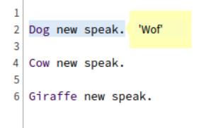
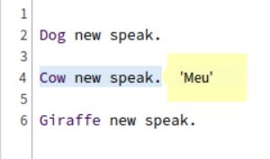
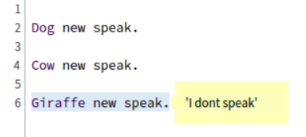

## EL MANSOURI Yacine

# SECOND WEEK :

## HOMEWORK : 

### Entraînez-vous à envoyer des messages

Mes lectures du cours ont ressortis principalement 2 concepts clés.
Un étant la répartition dynamique, à chaque fois qu'on envoie un message à un objet, le système trouve la bonne méthode à exécuter en fonction de la classe du récepteur et c'est le récepteur qui décide.
Cela permet d'éviter les instructions conditionnelles explicites comme if, case...
En gros, l'idée est de laisser le récepteur du message décider de la méthode à exécuter, plutôt que de charger le code avec des conditions comme on ferait dans d'autres languages.

Puis l'autre point se cachant derrière la hiérarchie de classes ( l'héritage ), chaque classe peut définir un comportement différent pour la même méthode. Elles jouent des cas de choix distincts. Cela permet d'étendre le comportement en ajoutant de nouvelles classes sans modifier le code existant.

### Exemple de code en Pharo 

Imaginons qu'on implémente un système où chaque objet peut être un animal qui émet un son. Nous allons utiliser la répartition dynamique pour éviter d'utiliser des if ou case.  

* Définition des classes et méthodes  
Nous avons donc la classe Animal abstraite qui par defaut correspond a un animal muet. Si une classe ne redefinit donc pas la methode speak, c'est qu'il est muet. Et toutes les classes qui redefiniront la methode speak auront un son personnel.

```
Object << #Animal
	slots: {};
	package: 'Homework2'

speak
	^'I dont speak'
```

```
Animal << #Cow
	slots: {};
	package: 'Homework2'

speak 
	^ 'Meu'
```

```
Animal << #Dog
	slots: {};
	package: 'Homework2'

speak 
	^ 'Wof'
```

```
Animal << #Giraffe
	slots: {};
	package: 'Homework2'
```

* Test du comportement  
Nous pouvons maintenant tester, en leur envoyant le message speak.  
  
  
  

On a donc bien le comportement attendu.
Les trois classes : Dog, Cow, et Giraffe héritent de la classe Animal. Chacune de ces sous-classes redéfinit la méthode speak mise a part la classe Giraffe qui est un animal muet.
Lorsque nous envoyons le message speak à chaque objet dans la collection, Pharo appelle automatiquement la méthode appropriée selon la classe de l'objet (soit Dog, Cow, ou Giraffe), sans avoir besoin d'utiliser des conditionnels comme if. Et vu que Giraffe ne definit pas la methode speak, c'est bien la methode speak de Animal qui est appelé.

**Les exemples ont-ils fonctionné comme prévu ?**
Oui, dans cet exemple, chaque animal a émis le son attendu. Cela illustre bien l'idée que l'envoi de messages permet de déléguer le choix de la méthode à la classe de l'objet, sans conditionnels explicites.

**Différence entre attentes et réalité ?**
On aurait tendance à penser a des conditionnelles en premier lieu si on ne connaitrait pas Pharo. Mais Pharo se charge automatiquement de choisir la bonne méthode en fonction de l'objet récepteur.

**Comment as-tu trouvé cette information ?**
J'ai principalement déniché les connaissances à travers le cours ( Module 1-1 | 1-2 )

### Conclusion
Pharo, en tant que langage purement orienté objet, encourage une approche où on laisse les objets décider de leurs actions en fonction des messages reçus, plutôt que de baser le code sur des conditions explicites. Cela rend le code plus modulaire, extensible, et élégant.
