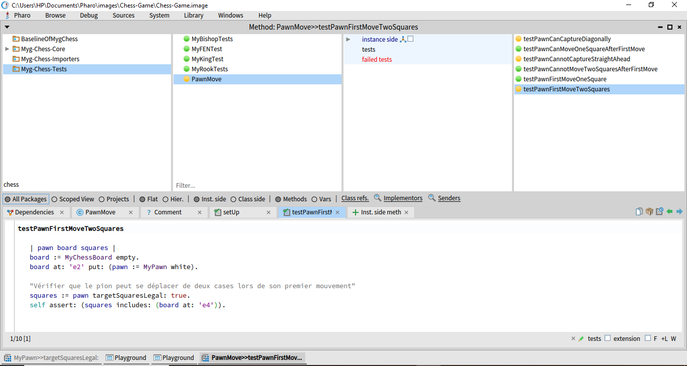

# Report Week 3 - Group 09

You can find all of our related changes under [this fork repo](https://github.com/mrdedede/Chess).

## André FILHO

For my Kata in the chess app, I picked a huge battle to tackle - restricting the legal moves of the pieces whenever it's been noticed a move could lead potentially to a check.

First, my instincts were telling me to just try the game out, see what's going on when we are using it normally, and it wasn't late until I experienced some very odd errors, being those the ones that called my attention the most:

- A player could play repeatedly, turn after turn, without letting their rival play
- Pawns are always moving up front and attacking pieces in front of them (not diagonally)
- Pawns are not being promoted once they get to the end
- Movements which would put the king under a check are not being banned.

So I started right away looking forward to the test cases in order to look what were testing, and actually I was quite surprised to learn that they were working fine for the king class, which made me wonder "What if we tested some other possibilities for the king's moves?"

Said and done, I started by writing test cases for all instances in which the king would be in a check or surrounded by pieces of opposite colours leaving him just few squares to move around, simple tests which didn't have any surprises, as the only test that got a different result from the one I expected was actually the pawn's movement.

So I believed things needed to get a bit more radical or deep, the problem isn't that the king class itself isn't able to tell appart whether it will be in check or not, is that there isn't a way to send this message to other pieces. We are in needed of a separated specific check for checks that sends messages to all classes.

In any case, just for some confirmation, I wrote some other tests for the classes that still had tests going on for them:
- Make sure that the piece which is pinned under a rook threatening the king can not move to any square it normally could besides the ones that would kill it or still be in front of it

To put it briefly, here are some things I'd got to do for the next iterations:
- Write test cases for the possibilites of other pieces' moves
- Write tests to check if they are being blocked if the king is pinned to them
- Create a "global" check for checks, under the MyPiece class, which will check if a king of the same colour on the board will be check after a certain move and, if that's the case, take this possibility out of the moves array


# Salim TITOUCHE

# Introduction

Nous avons étudié le cache LRU et exécuté quelques codes. Voici un exemple que nous avons abordé en classe :

```smalltalk
primeFactorsCache := LRUCache new.

50 timesRepeat: [
  | n |
  n := 100 atRandom.
  primeFactorsCache at: n ifAbsentPut: [ n primeFactors ]].
```

Ensuite, j'ai commencé à travailler sur le projet Chess, avec pour objectif d'améliorer et de comprendre le code, puis de créer des tests afin de mieux appréhender son fonctionnement.


## Objectifs

Le projet se décompose en trois tâches :

1. **Tests manuels et refactoring** : Choisir l'un des katas du fichier README du projet en rapport avec les refactorings, puis rédiger des tests manuels pour s'assurer que le refactoring n'introduit pas de régressions.

---

## Tâche 1 : Tests manuels et refactoring

### Fonctionnalités à tester pour le refactoring

Dans cette tâche, j'ai choisi de me concentrer sur les mouvements des pions. Les fonctionnalités à tester comprennent :

- Un pion peut se déplacer de deux cases lors de son premier mouvement.
- Un pion peut se déplacer d'une seule case après son premier mouvement.
- Un pion ne peut pas se déplacer de deux cases après son premier mouvement.
- Un pion peut capturer une pièce adverse en diagonale.
- Un pion ne peut pas capturer une pièce en face de lui.

### Tests écrits et justifications

1. **Test du déplacement de deux cases pour le pion lors du premier mouvement**

    ```smalltalk
    testPawnFirstMoveTwoSquares
        | pawn board squares |
        board := MyChessBoard empty.
        board at: 'e2' put: (pawn := MyPawn white).

        "Vérifier que le pion peut se déplacer de deux cases lors de son premier mouvement"
        squares := pawn targetSquaresLegal: true.
        self assert: (squares includes: (board at: 'e4')).
    ```

    **Justification** : Ce test s'assure que le pion peut avancer de deux cases (de 'e2' à 'e4') lors de son premier mouvement.
    Le test a échoué, donc il existe un problème qu'il faut résoudre dans les prochains rapports.

2. **Test du déplacement d'une seule case pour le pion lors du premier mouvement**

    ```smalltalk
    testPawnFirstMoveOneSquare
        | pawn board squares |
        board := MyChessBoard empty.
        board at: 'e2' put: (pawn := MyPawn white).

        "Vérifier que le pion peut se déplacer d'une seule case lors de son premier mouvement"
        squares := pawn targetSquaresLegal: true.
        self assert: (squares includes: (board at: 'e3')).
    ```

    **Justification** : Ce test vérifie que le pion peut également avancer d'une seule case (de 'e2' à 'e3').

    - test validé

3. **Test que le pion ne peut plus se déplacer de deux cases après son premier mouvement**

    ```smalltalk
    testPawnCannotMoveTwoSquaresAfterFirstMove
        | pawn board squares |
        board := MyChessBoard empty.
        board at: 'e2' put: (pawn := MyPawn white).

        "Simuler le premier mouvement du pion à 'e3'"
        pawn moveTo: 'e3'.

        "Vérifier que le pion ne peut plus se déplacer de deux cases après son premier mouvement"
        squares := pawn targetSquaresLegal: true.
        self deny: (squares includes: (board at: 'e5')).
    ```

    **Justification** : Ce test s'assure que le pion ne peut plus avancer de deux cases après avoir déjà effectué un mouvement.
        - test validé

4. **Test que le pion peut capturer une pièce adverse en diagonale**

    ```smalltalk
    testPawnCanCaptureDiagonally
        | whitePawn blackPawn board squares |
        board := MyChessBoard empty.
        board at: 'e2' put: (whitePawn := MyPawn white).
        board at: 'd3' put: (blackPawn := MyPawn black).

        "Vérifier que le pion blanc peut capturer le pion noir en d3"
        squares := whitePawn targetSquaresLegal: true.
        self assert: (squares includes: (board at: 'd3')).
        self assert: (whitePawn canCapture: blackPawn).
    ```

    **Justification** : Ce test vérifie que le pion blanc peut capturer le pion noir en diagonale.
    - Le test a échoué,il faut régli aussi ce problem .

5. **Test que le pion ne peut pas capturer un pion en face de lui**

    ```smalltalk
    testPawnCannotCaptureStraightAhead
        | whitePawn blackPawn board squares |
        board := MyChessBoard empty.
        board at: 'e2' put: (whitePawn := MyPawn white).
        board at: 'e3' put: (blackPawn := MyPawn black).

        "Vérifier que le pion blanc ne peut pas capturer le pion noir en face de lui"
        squares := whitePawn targetSquaresLegal: true.
        self deny: (squares includes: (board at: 'e3')).
        self deny: (whitePawn canCapture: blackPawn).
    ```


    **Justification** : Ce test s'assure que le pion ne peut pas capturer un pion adverse en face de lui, ce qui est conforme aux règles du jeu.
        - Le test a échoué, doc il faut interdire ce movment   .


### Tests non écrits et justifications

1. **Tests pour les mouvements latéraux** : Les pions ne peuvent pas se déplacer latéralement. Aucun test n'a été écrit pour cela car ce comportement est déjà implicitement couvert par les tests de capture et de mouvement.

2. **Tests pour des cas extrêmes (fin de partie, promotion)** : Ces tests n'ont pas été inclus dans cette phase initiale car ils nécessiteraient une complexité supplémentaire et ne sont pas directement liés aux règles de mouvement des pions.

---

  
_Figure 1 : Capture des tests réalisés `if-else`._  

### Code des tests

- [GitHub](https://github.com/salim2607/Chess/blob/main/src/Myg-Chess-Tests/PawnMove.class.st)


## Conclusion

Ce projet m’a permis tout d’abord de comprendre le fonctionnement du jeu en inspectant les classes et les tests déjà créés. Ensuite, j’ai commencé à créer mes propres tests et à les exécuter.

## Suite à faire

J’ai commencé à travailler sur les changements pour améliorer le jeu, mais pour l’instant je rencontre des erreurs dans le code.
