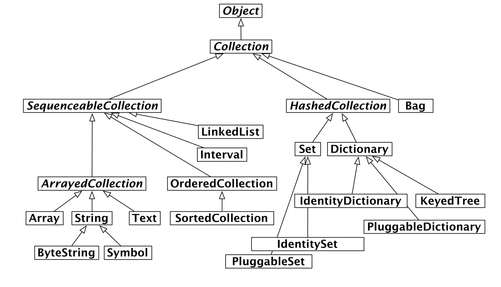

# Rapport semaine n°1 - Groupe 10

## Elsa Logier

Cette semaine j'ai étudié Pharo avec des supports variés. J'ai utilisé le Mook en Français sur youtube, Pharo en lui-même pour expérimenter et rechercher, le discord pharo, le livre *Pharo with style*, la documentation de pharo sur github (pharo-open-documentation/pharo-wiki), la cheat sheat pharo ainsi que les slides disponibles sur le github du cours. 
J'ai aussi préparé le cours de la semaine prochaine en regardant les vidéos du mooc associées.


### Une Issue

Cette semaine, j'ai créé une issue dans pharo :
https://github.com/pharo-vcs/iceberg/issues/1844


### Les Collections 

Pour en apprendre plus sur les collections j'ai cherché dans le Finder de pharo mais je n'ai rien réussi à trouver de concluant. 
J'ai ensuite regardé le MOOC sur Youtube pour trouver des informations. 
J'ai retrouvé mes notes de l'année dernière sur la Syntaxe de pharo. 


On peut copier un tableau
```
#('hello' 'World') copy at: 2 put: 'Pharo'; yourself.
>#('hello' 'Pharo')
```

On peut "générer dynamiquement" des tableaux
```pharo 
{ #('bip' 'World') copy at: 2 put: 'bop'; yourself. 3 . (6*60) } 

>#(#('bip' 'bop') 3 360)

{ 3 . 14 . 28 }
>#(3 14 28)
```

Itérer sur une collection : 
```Pharo
#(1 2 3 4)
do: [:each | Transcript show: each abs printString;cr]
> 1 
> 2
> 3
> 4
```

#### Les itérateurs des collections 

```Pharo
do: (pour itérer)

collect: (pour itérer et récupérer les résultats pour les emttre dans une nouvelle collection)

select: (pour sélectionner un ensemble d'éléments à l'intérieur d'une collection pour en créer une autre)

reject: (pour éliminer des éléments d'une collection)

detect: (pour renvoyer le premier élément qui correspond dans une colleciton)

detect:ifNone (pour renvoyer le premier élément qui correspond dans une collection ou une valeur par défaut)
```


>[!note]
>L'index d'un tableau en pharo commence à 1
### Les conditionnelles
*Source: Mook vidéo 19 (Messages pour les programmeurs Java)*
Les conditionnelles sont des messages en pharo et non des mots clé.

on a 'ifTrue:' et 'ifFalse'


### Créer des classes et des méthodes

Pour revoir la création des tests et des méthodes j'ai créé une classe Peluche comportant trois variables de classes (prix nom et type). J'ai créé la méthode d'initialisation ainsi que les accesseurs.

Pour réutiliser les collections j'ai créé une classe magasin avec une variable stock.
J'ai réussi à initialiser la collection mais malgré mes recherches (sur la cheat sheet , le chanel discord pour les débutants, mes notes, ...) je n'ai pas réussi à trouver comment ajouter un élément dans une collection. Je compte donc poser la question une fois de retour en cours.

### Coding Style
Lors de cette semaine voici les normes de codage en Pharo que j'ai revues ou apprises (cela correspond au premier chapitre du livre *Pharo with Style* ):


- Le Camel Case est utilisé pour les noms de méthodes et de classes
- Utiliser des noms descriptifs et le plus précis possible pour éviter l'ambiguïté 
- Les méthodes commencent avec des minuscules
- Les noms de classes, variables globales et variables e classes commencent par une majuscule
- Les variables privées commencent par une minuscule
- Pas d'underscore dans les noms. 
- Le nom d'une classe enfant doit indiquer le nom de sa classe parent en suffixe
- Ajouter le nom de la classe dans une méthode pour éviter les problèmes de redéfinition accidentel

### Cascade et block Closure
*Source : Notes des années précédentes, vidéo 5 Mook pharo (Syntaxe pharo), vidéo 22 Mook pharo (Introduction aux Blocs)*

Cascade : ";" utilisé pour envoyer plusieurs messages au même mot clé 

Block -> Méthode anonyme ou clôture lexicale 
On peut mettre les blocs dans des variables, en argument de fonction
On peut leur donner plusieurs arguments en mettant "value: value: ...." après le block 

```Pharo
[:x | x + 2] value: 5
```

### Autres recherches

Cette semaine, j'ai revu aussi les messages et leur hiérarchie, les différents boucles disponibles dans pharo ainsi que les messages de débogage.

## Aymeric Jakobowski

### Réalisé en cours

J'ai durant ce premier cours découvert un peu les possibilités de Pharo, le POURQUOI que ce langage est enseigné dans notre formation. Bien qu'un peu original des cours qu'on a l'habitude d'avoir, j'ai l'impression que ce cours va me faire progresser. Tant en soft-skills qu'en compréhension du paradigme objet.

Durant les vacances précédentes, Elsa Logier m'avait conseillé de me préparer un peu à ce langage de programmation. Elle m'a partagé le MOOC (en français sur Youtube). Une chose que j'ai donc faite.
Ainsi, lorsque la partie TP du cours à commencé, l'IDE était déjà installé et j'ai réalisé (une seconde fois, pour me remettre dans le bain) le tuto du ProfStef.

J'ai ensuite attaqué le [TP n°1](http://rmod-pharo-mooc.lille.inria.fr/MOOC/PharoMOOC/Week1/Exo-Counter.pdf) (Developing a simple counter - PDF). J'ai réalisé le TP jusqu'à la partie Git.

Enfin, j'ai pu aider quelques camarades à configurer leurs Git pour la synchronisation de code avec Iceberg. En effet, j'ai eu la chance de beaucoup manipuler Git en BUT informatique et en entreprise.

### Réalisé à la maison

Dans cette section, je vais réaliser une liste des choses que j'ai réalisé :
- Regarder Karaté Kid (pour une fois qu'il y a un devoir de ce type, autant en profiter !)
- Suivi des vidéos du MOOC
  - Module 0 (Little Warm up with Pharo) : Bien que j'ai déjà suivi ce module durant les grandes vacances, j'ai de nouveau regardé, mais d'un regard différent, en me focalisant sur d'autres détails qui auraient pu m'échapper lors de la première lecture.
  - Module 1 (Understanding messages) : C'était à réaliser pour la prochaine séance.
  - Module 2 (Tests) : En voyant le module et en ayant pratiqué durant la séance, j'ai vu un aspect que je n'avais pas réèlement saisi avant sur la méthode TDD. Certes, je l'avais vu en BUT informatique, mais nous n'étions pas vraiment convaincu de la chose. Mais vous avoir vu faire une démonstration sur la manière de raisonner m'a fait comprendre le POURQUOI utiliser cette méthode de travail !!
- Groupe Discord rejoint
- Fin du TP n°1, voici le [lien GitHub](https://github.com/AymericJak/my-counter-pharo)

### Exercices

> Learn about collections in Pharo and their iterators

Une collection est une structure de données. Elle va permettre de regrouper des objets (éléments) et de les gérer.

En Pharo, on peut retrouver ces collections :


Voici un exemple de liste, et la manière d'itérer dessus :
```
#(1 2 3 4 5) do: [:each | Transcript show: each; cr]
```

Source : [M0-12 - Iterators](http://rmod-pharo-mooc.lille.inria.fr/MOOC/PharoMOOC/Week3/C019-W3S09-Iterators.pdf)

> Learn about conditionals in Pharo

En Pharo, les conditions sont de cette forme :
```
condition
    ifTrue: [code à exécuter]
    ifFalse: [code à exécuter]
```

Contrairement à d'autres langages, la condition précède le `if`. Puisque l'ensemble de l'expression se lit de gauche à droite. Ainsi : `condition <- if <- code`.

C'est une autre manière de penser. D'un côté, le langage reste propre et cohérent. Mais d'un autre côté, la syntaxe est moins familière avec les autres langages (par exemple en python : `if condition: code à exécuter`)

Source : [Youtube - Booléens et conditions (W2S8-FR)](https://www.youtube.com/watch?v=lsnndemTkao&list=PL2okA_2qDJ-k83Kxu_d8EPzMXtvCrReRn&index=25)

> Learn how to create classes and methods

La première étape consiste à se rendre dans le `System Browser` puis de créer un nouveau package.

Ensuite, dans la fenêtre en bas, nous pouvons remplir les informations de la classe, la sauvegarder pour qu'elle soit enregistrée dans le package. On peut aussi ajouter une documentation dans l'onglet `comment`.

Voici le repository GitHub : [facebike-pharo](https://github.com/AymericJak/facebike-pharo)

En quelques mots, j'ai créé un getter, un setter, une méthode d'initialisation et une fonction pour ajouter un utilisateur à la liste des utilisateurs.

Voici le code pour tester :
```
| myUsers |
myUsers := Users new.
myUsers addUser: 'John'.
myUsers addUser: 'Jane'.
myUsers addUser: 'John'.

myUsers users do: [ :user|Transcript show: user; cr ]
```

Il est aussi important de réaliser des tests unitaire pour chacune de ces méthodes (non fait dans cette exemple, mais je le ferai pour la semaine prochaine)

> Learn about the basic Pharo coding style

Dans le livre `Pharo with Style`, on peut retrouver les différentes conventions à appliquer dans le langage. En voici quelques unes :
- Pour les noms de classe, variable, il faut utiliser le camel case. Exemple : `NomDeClasse, nomDeMethode, ...`
- Utiliser des noms de variable clairs (c'est logique, pour la maintenabilité, c'est plus simple). Exemple : `tod => timeOfDay, éviter les x y ou z, ...`
- Commenter les méthodes, classes. C'est toujours dans une optique de maintenabilité.
- Pour les tests unitaires, utiliser des formes interrogatives.

Pour repérer ce genre « d'erreurs », il y a par exemple un outil de linting dans Pharo lui même. Par exemple, quand j'ai créé la méthode `initialize`, j'ai eu une petite alerte pour indiquer que la méthode est censée faire être incluse dans le protocole `initialization`. Un simple refactoring, mais ça permet d'avoir une bonne organisation et cohérence entre les différents packages / projets.

Sources : livre [Pharo with Style](https://github.com/SquareBracketAssociates/Booklet-PharoWithStyle/releases/download/continuous/WithStyleBook-wip.pdf) et expérience personnelle (alternance, sur un projet datant de 2012)
