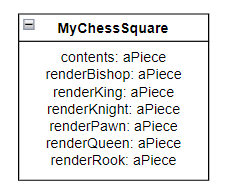
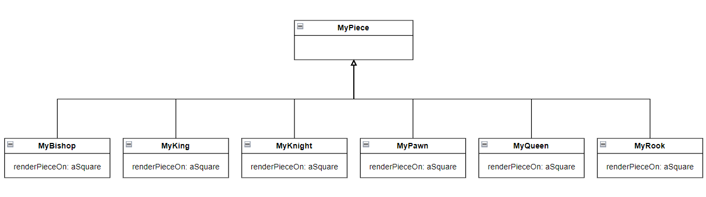

# Weekly Report 3

20/09/24-27/09/24

# Maureen's section

## Exercices
I try the exercise about LRU cache : https://github.com/maureencfr/C3P/blob/main/src/LRUCacheReverseEngineering.md

## Watch at home: about design

### Objects VS Data

I liked this course because it make me think about the fact that it's not because it's Java (or another language) implementation that it's the right thing to do. It makes me a reminder to not confound objects and data structure.

### About global variables

I don't have questions for this course

### Global to parameter

I don't have questions for this course.

### Singleton
I read the slides and find that it is interesting to block the "new" method. I never think of doing that.

## Extras about language

For example, if we define a class Animal that have "specy" for intance variable and a method "initializeWithSpecy" to create an animal with a given specy. We can create a class Herbivorous that redefine "initializeWithSpecy" using super : 

    Herbivorous >> initializeWithSpecy: aSpecy diet: aDiet
    super initializeWithSpecy: aSpecy.    
    diet := aDiet.
    

Here the method will call initializeWithSpecy of Animal class and then initialize diet variable, because Animal is the superclass of the class who invoke super, so the lookup start there.

## Prepare

I read the slides and start working on the chess project. I choose a kata : Moving pawns, and think about how to test it. 
First I want to test if, in the actual version, the pawn kill another piece just by move forward (this is not supposed to happen) and fix the code consequently. Second I want to create the test cases for a simple kill (when a pawn move diagonally to kill another piece).  

# Julien Conoir

### Reading

This week I started by watching the ‘Objects vs Data’, ‘About global variables’ and ‘Global to paramater’ videos.  
I learnt that the difference between an object and a data structure is that an object has a richer API that includes the basic functions and therefore avoids each client having to define them.  
On the subject of global variables, I realised that it wasn't a good idea to use them because it made testing more complicated and the code less modular. You also have to be careful about global variables that could be hidden in instance variables.  

### Project

I decided to do the questions of reverseEngineering directly on the Chess project, and more particularly on the kata that I chose: Refactor piece rendering.  

In the class browser you can see that the project is composed of 4 packages:  
    - BaselineOfMygChess  
    - Myg-Chess-Chore  
    - Myg-Chess-Importers  
    - Myg-Chess-Tests  

It is immediately noticeable in the package "Myg-Chess-Chore" that there is very little comment for classes.  
However, in the class "MyChessGame" you will find instructions to start the chess game.  

At the level of tests, there are 4 classes of tests for 13 passing tests.  
I do not understand the results of the coverage test which gives me a score of 45% for the package "Myg-CHess-Chore" while only 4 methods are partially covered for 81 uncovered methods.  

Then I became more interested in the methods that concerned my kata. In the class "MyChessSquare" there are 6 methods that start with "render..." and have almost the same code structure. We could do some refactoring on it to avoid code duplication. It is also noted that there are too many conditions within the methods and that it will therefore be necessary to do double dispatch.  
If we look at the senders, each "render..." message is used in the "renderPieceOn" method of each game piece. The "renderPieceOn" message is then used in the content method of the "MyChessSquare" class.  

### Question

What is table dispatch ?