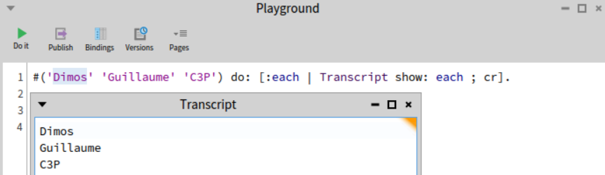
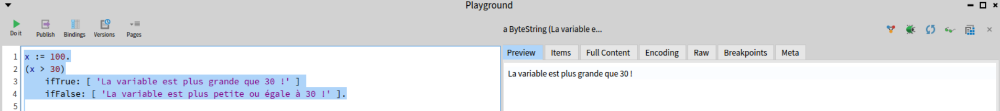
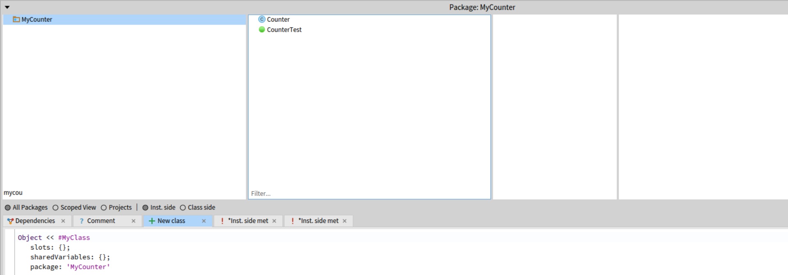

*Auteur MOUSSED-WERNITZ Dimos & GOOSSEN Guillaume* 
# Guillaume GOOSSEN
## Apprendre les collections dans Pharo et leurs itérateurs

#### Qu'est-ce qu'une collection et à quoi sert-elle ?

En Pharo une collection est une structure de données qui permet de regrouper plusieurs éléments dans un même ensemble. Elles peuvent contenir n'importe quel type d'objet.

Les collections sont utiles pour stocker et manipuler des données de manière organisée. Elles permettent de parcourir les éléments, de les modifier, ou de faire des recherches.

Elles partagent une API commune 'Collection' avec des méthodes comme `size`, `do:`, `collect:`, et permettent des conversions faciles entre elles, comme `asSet`, `asArray`.

Les index des collections commencent à 1 en Pharo.
#### Quels types de collections la bibliothèque standard de Pharo propose-t-elle ?

Pharo propose plusieurs types de collections, chacun adapté à des besoins spécifiques par exemple :

- **Array** : Un tableau de taille fixe, comme en Java, qui permet de stocker des éléments et d'y accéder par leur position.
- **OrderedCollection** : C'est une collection dynamique, où l'on peut ajouter et retirer des éléments facilement. C'est un peu comme une **ArrayList** en Java.
- **Set** : Une collection qui ne permet pas les doublons. Elle est utile quand on veut stocker des éléments uniques.
- **Dictionary** : L'équivalent de la **HashMap** en Java, elle stocke des paires clé-valeur.
#### Comment itérer sur des collections et quelles sont les différences entre elles ?

En utilisant le message `do: aBlock` qui tère sur chaque élément d'une collection



Ou encore :
- `collect` qui transforme chaque élément de la collection en utilisant un bloc de code et retourne une nouvelle collection avec les résultats
- `select` filtre les élément en fonction d'une condition
- `reject` exclue les éléments qui répondent à la condition
- `detect` recherche le premier élément qui répond à la condition donnée
#### Sources : 
- http://rmod-pharo-mooc.lille.inria.fr/MOOC/PharoMOOC-Videos/FR/Week3/C019SD-W3-S7-v3.mp4
- http://rmod-pharo-mooc.lille.inria.fr/MOOC/PharoMOOC-Videos/FR/Week3/C019SD-W3-S9-v3.mp4
- ChatGPT
## Apprendre les conditionnelles dans Pharo

#### Comment écrit-on des conditionnelles en Pharo ?

L'écriture des conditionnelles en Pharo peut se faire par l'intermédiaire de `ifTrue:ifFalse:` mais encore `ifEmpty:ifNotEmpty:`. Les conditionnelles sont toujours des messages envoyés à des booleans ou a des blocs.



#### Qu'est-ce qui est différent des autres langages de programmation ?

A l'inverse des autres langages de programmation plus répandu on ne retrouve pas le traditionnel `if else` en Pharo, mais plutôt `ifTrue:` et `ifFalse:` directement.
#### Pouvez-vous penser aux avantages et inconvénients de cette approche ?

Comme avantage on pourrait évoquer la simplicité d'apprentissage et lisibilité pour un débutant. En effet Pharo cherche a simplifié cet aspect en lisant le code code une phrase d'où l'utilisation de `ifTrue` et `ifFalse`. En inconvénient on peut à l'inverse trouver que ça complexifie l'apprentissage pour des développeurs avec un niveau avancé dans d'autres langages car l'utilisation de `ifTrue` et `ifFalse` n'est pas communes

#### Source :
- http://rmod-pharo-mooc.lille.inria.fr/MOOC/PharoMOOC-Videos/FR/Week2/C019SD-W2-S8-v2.mp4
## Apprendre à créer des classes et des méthodes

#### Comment écrire un petit programme avec des classes et des méthodes en Pharo ?

Pour se faire nous utilisons 'Nautilus' dans la partie inférieur on va pour retrouver la définition de la classe



#### Source :
- http://rmod-pharo-mooc.lille.inria.fr/MOOC/PharoMOOC-Videos/FR/Week1/C019SD-W1-S6-v3.mp4
#### Quel programme avez-vous écrit ?

Un programme accès autour du compteur via l'exercice de la semaine 1 sur le dépôt git suivant :
- https://github.com/GuillaumeGoossen/C3P-Counter.git
#### Quels problèmes avez-vous rencontrés ?

Aucun réel problème n'a été rencontré, j'ai regardé les vidéos misent à disposition. Néanmoins il a été compliqué de push sur github.
## Apprendre le style de codage de base en Pharo

#### Quelles règles faut-il suivre couramment ?

Il faut nommer les méthodes et variables de manière explicite pour refléter leur fonction, de veiller à ce que chaque méthode ait une seule responsabilité et soit concise. Les méthodes de sélection commence par une minuscule et il faut favoriser le 'camel case'.
#### Existe-t-il des outils qui vous montrent les violations de ces règles ?

On peut utiliser :
- Critic Browser
- SmallLint
- Refactoring Browser
#### Veuillez montrer des exemples de code qui violent certaines règles :

``` 
MyClass >> doIt
    "Nom de méthode peu clair, ne dit pas ce que la méthode fait"
    ^ self value * 2.
```

```
MyClass >> fetchAndDisplayData
    "Fait deux choses différentes : récupérer et afficher les données"
    self fetchData.
    self displayData.
```
#### Source : 
- Livre 'Pharo with style'
- ChatGPT
## Extras

#### Pouvez-vous en apprendre plus sur les cascades et les fermetures de blocs ? 

#### Comment l'abordez-vous ?

