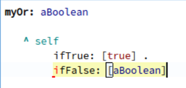
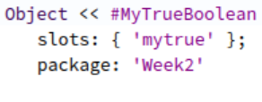
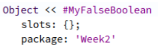
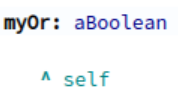
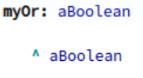
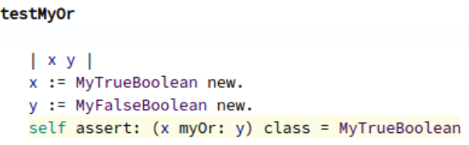
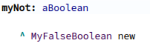
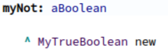
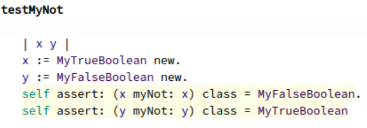

*Auteurs : Dimos MOUSSED-WERNITZ & Guillaume GOOSSEN*

# Guillaume GOOSSEN

# Devoirs/Rapports

Pour le cours de la semaine prochaine, vous devez effectuer les tâches suivantes et préparer un bref rapport sur la manière dont vous les avez abordées. Chacune des tâches suivantes sera guidée par des questions. Vous devez répondre à ces questions dans le rapport.
### S'entraîner à l'envoi de messages

**Rédigez de petits exemples de code mettant à l'épreuve vos connaissances sur le dispatching.**

Pour ce faire j'ai regardé la vidéo "Exercises for Essence of Dispatch" recommandant de faire l'implémentation de `not`, `or` et `ifTrue:ifFalse`. 

Voici par exemple l'implémentation de `or` tout d'abord pour la classe True :

```
myOr: aBoolean
	^ self
```
Puis pour la classe False :

```
myOr: aBoolean
	^ aBoolean
```

Ces implémentations m'ont permis de prendre conscience de l'utilité d'avoir deux classes distinctes `True` et `False` facilitant ainsi les implémentations précédentes. Tout est objet et tout se passe par des messages. La sélection de la méthode va dépendre de la classe du receveur

Il existe différents types de dispatch :
- unaire :
```
true not.
```
- binaire
```
true & false.
```

J'ai crée deux classes `Car` et `Bike` ayant toutes deux une méthodes move disant que la voiture roule et le vélo pédale le fonctionnement était correct dans le playground

Puis ensuite on crée une classe parente à `Car` et `Bike` nommée `Vehicle` avec la méthode `move` suivante :
```
move 
    self subclassResponsibility.
```

**Les exemples ont-ils fonctionné comme prévu ?**

Oui l'objectif était que le code suivant renvoie là aussi 'roule' et 'pédale' dans le Transcript, néanmoins lorsque j'ai lancer mon script dans le Playground je regardais au mauvais endroit pour obtenir le résultat : 
```
myCar := Car new.
myBike := Bike new.

vehicles := { myCar. myBike }.

vehicles do: [ :each | Transcript show: each move; cr ].
```

**Qu'est-ce qui diffère entre ce que vous attendiez et ce que vous avez vu en réalité**

Il n'y a pas de différence l'objectif était de voir que nos méthodes move soient appelé en fonction du type 

**Comment pouvez-vous corriger vos hypothèses et comment avez-vous trouvé ces informations ?**

Pour corriger mon code j'aurai pu consulter le MOOC, demander à d'autres étudiants ou peut-être utiliser ChatGPT

**Source :**
- http://rmod-pharo-mooc.lille.inria.fr/AdvancedDesignMooc/Videos/M01_S1.mp4
- http://rmod-pharo-mooc.lille.inria.fr/AdvancedDesignMooc/Videos/M01_S2_V2.mp4
  
# Dimos MOUSSED-WERNITZ  
## Implémentation de or ou |  
J'ai essayé d'implémenter or en Pharo.  
Ma première idée était de faire une classe myBoolean avec pour méthode myOr: qui ressemblait à ceci :  
  
Or je rencontre un soucis puisqu'il ne peut pas appliquer ifTrue et ifFalse pour self. J'avais donc 2 solutions :  
- Créer mes propres ifTrue et ifFalse  
- Créer 2 classes de Booleens, comme le fait Pharo  

J'ai donc choisi la 2ème option et j'ai créer 2 classes :  
  
  
  
  

mon test ressemble à ceci :  
  

## Implémentation de not  
Pour ce qui est du not ça me parraissait donc évident d'utilser toujours ces 2 même classes pour avoir mon myNot :  
  
  
Et mon test ressemble à ceci :  
mon test ressemble à ceci :  
  

## Bilan
Ce que j'ai surtout appris avec tout ça est la manière dont on implémente les Booleen en Pharo et donc l'importance d'avoir 2 classes.  

**Sources** : Je me suis surtout aidé du Module 1 avec les vidéos sur l'implémentation des Booleens en Pharo.
J'ai d'ailleurs vu toutes les vidéos de la partie week2.


