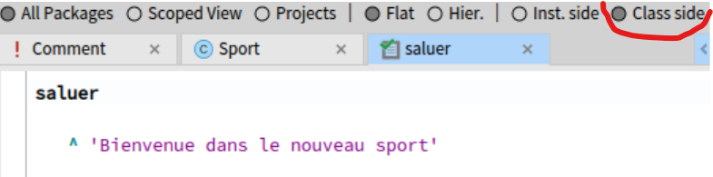
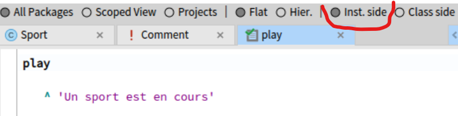
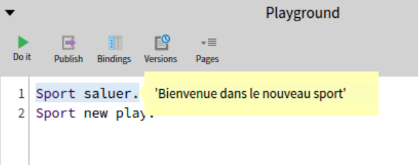
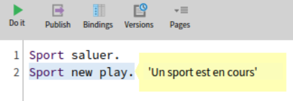
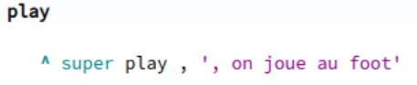
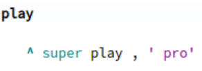
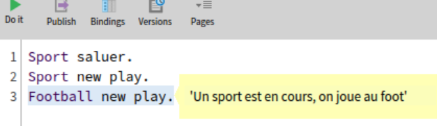
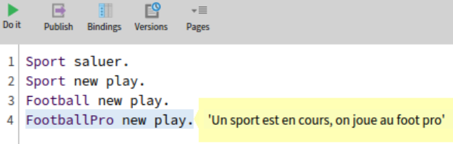
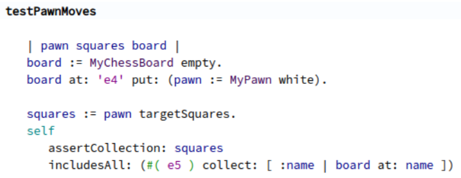

# Dimos MOUSSED-WERNITZ  
### Objets vs Données  
L'API en Pharo est très riche comparé à Java.  
Le problème d'une API moins riche est que quand un objet y est exposé, cela favorise la duplication de logique ou de code.  
En réalité Les Objets sont plus que de simples structures de données. Le plus important est le comportement et les services qu'ils apportent.  
Les clients devraient pouvoir être en mesure de réutiliser la logique encapsulé par le parent.  
### Variables globales  
Les variables globales peuvent prendre différente formes.  
Elles peuvent être déguisée. Il faut éviter d'utiliser les `asClass`. Mais on pourrait déléguer la variable au système pour avoir son environnement.  
Le bon point des var. globales est que quand elles changent, tous les utilisateurs sont mis à jour gratuitement.  Mais donc il faut garder à l'esprit que ces variables partagés devraient être mises à jour.  

### Quelques exemples de méthodes  
Pour bien saisir la différence entre les méthodes de classe et les méthodes d'instance je me suis fait une Clase `Sport` et j'ai ajouté une méthode d'instance et une méthode de classe :  



  

J'ai ensuite décidé de créer une sous-classe `Football` qui hérite de Sport et personnalise la méthode `play`.
Et ainsi de suite avec `FootballPro` pour utiliser super :  



  

## Etape 1 du projet  
J'ai commencé à lire le code du projet CHESS, à comprendre la structure du projet, et à comprendre la structure des classes.  
Et j'ai donc écris un test qui concerne le déplacement basique d'un pion, histoire de m'acclimater au projet.
Voici mon test, fonctionnel :  


# Guillaume GOOSSEN

## Watch at home: about design

- **Objets vs. Données**
Une API riche permet d'éviter de la duplication de code, permet d'alléger le code aussi. Cela permet aussi de simplifier le code. Les objets sont plus que des structure de données car ils peuvent encapsuler des données et des comportements

- **À propos des variables globales**
Éviter les variables globales pour encourager la modularité et la spécialisation des comportements. Adopter des approches qui favorisent le polymorphisme et la configuration individuelle. `asClass` : Cette méthode d'accès aux classes via un point d'entrée global ne permet pas de changer d'environnement ou de namespace facilement.

- **Global à paramètre**
Remplacer les variables globales par des paramètres ou des variables d'instance facilite les futurs changement, la testabilité et l modularité

- **Méthode de classes et super**
Je me suis basé sur le code utilisé la semaine dernière pour déjà mettre en avant les notions, dans ma classe Vehicle j'ai ajouté une méthode salut ainsi que dans Bike et Car en utilisant super.
## Project milestone 1

J'ai choisi le kata : **Refactor piece rendering**. Tout d'abord j'ai essayer d'analyser d'un peu plus près le sujet en essayant de comprendre le rôle de certaines classes par exemple. Je remarque que les classes principales se situent dans le package `Myg-Chess-Core` :
-  `MyBishop.class.st`, `MyKing.class.st`, `MyKnight.class.st`, `MyPawn.class.st`, `MyQueen.class.st`, `MyRook.class.st` : Classes représentant les différentes pièces d'échecs ayant comme classe mère `MyPiece`
- `MyChessSquare` qui semble représenter une case du plateau

J'ai remarqué que dans le code actuel on semble utiliser des méthodes spécifiques pour chaque type de pièce dans la classe `MyChessSquare`. J'ai alors essayé d'utiliser le double dispatch pour déléguer le rendu à la pièce elle même, puis la pièce appelle la méthode approprié. Un test `testRenderKnight` a été effectué pour vérifié le bon fonctionnement 

Ce qui donne : 
```
MyKnight >> renderOn: aSquare [
    ^ aSquare renderKnight: self
]

MyChessSquare >> renderPiece: aPiece [
    ^ aPiece renderOn: self
]

MyChessSquare >> renderKnight: aKnight [
    ^ aKnight isWhite
        ifTrue: [ color isBlack ifTrue: [ 'n' ] ifFalse: [ 'N' ] ]
        ifFalse: [ color isBlack ifTrue: [ 'm' ] ifFalse: [ 'M' ] ]
]
```
