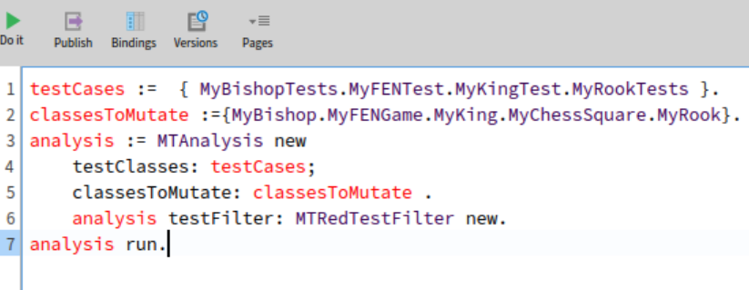
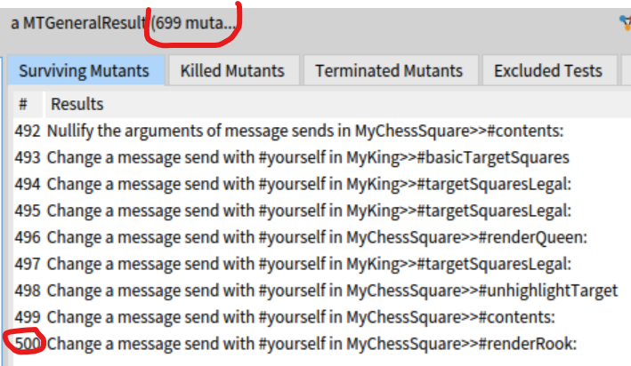
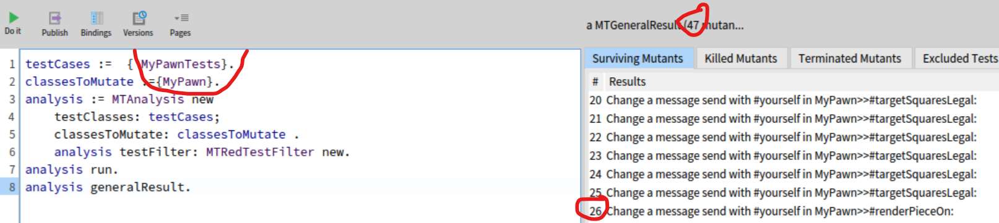

*Author Dimos MOUSSED-WERNITZ & Guillaume GOOSSEN*

**An introduction to design patterns** : Les design patterns sont des solutions récurrentes à des problèmes de conception, permettant la réutilisation de code et l'amélioration de la modularité tout en étant appliqués avec prudence pour éviter une complexité excessive​

**Message Sends Are Plans for Reuse** : L'envoi de messages dans une classe permet de définir des points d'extension, appelés hooks, que les sous-classes peuvent redéfinir pour personnaliser et réutiliser efficacement le code

**Hooks et Template** : Les méthodes template définissent un cadre avec des hooks que les sous-classes peuvent personnaliser, offrant ainsi flexibilité et extensibilité dans la conception orientée objet

**Using well asString and printString: A Pharo code idiom** - Utiliser les méthodes `printOn:`, `asString` et `printString` correctement permet d'éviter la création d'objets superflus et optimise l'efficacité.

**Global to parameter** : Remplacer les variables globales par des paramètres, comme des variables d'instance, améliore la modularité, la testabilité et la flexibilité du code.

**Mutate your tests** :

J'ai lancé le code suivant dans le Playground :
```
testCases :=  { MyBishopTests.MyFENTest.MyKingTest.MyChessSquareTest.MyRookTests }.
classesToMutate :={MyBishop.MyFENGame.MyKing.MyChessSquare.MyRook}.
analysis := MTAnalysis new
    testClasses: testCases;
    classesToMutate: classesToMutate .
    analysis testFilter: MTRedTestFilter new.
analysis run.
analysis generalResult.
```

"848 mutants, 223 éliminés, 625 vivants, 0 terminés. Score de mutation : 26%". Cela reste compréhensible pour l'instant, car toutes les méthodes ne sont pas encore testées. Ainsi, les mutants générés pour ces méthodes restent vivants, ce qui explique le faible score de mutation.

En examinant le **Test Coverage**, on constate que dans `Myg-Chess-Core`, la couverture de code est de 43,59%, et dans `Myg-Chess-Importers`, elle est de 14,63%.

J'ai donc commencé à réécrire certains tests et à modifier ceux existants pour qu'ils couvrent correctement les méthodes concernées.

# Dimos MOUSSED-WERNITZ  

Je ne connaissais pas trop le concept de mutation Testing.
Je pensais que c'était le fait d'introduire des bugs dans nos tests et de vérifier que ces tests passez au rouge ou quelque chose du genre.  
En réalité c'est plutôt une manière de s'assurer de la fiabilité de nos tests en introduisants des "mutants" non pas dans les tests mais dans le code directement. 
Et donc de voir si nos tests verts ne sont pas potentiellement des "faux tests verts" <=> tests qui ne couvrent pas tout correctement.  

## Dans Chess  
J'ai donc voulu tester ce principe sur le projet Chess.  
J'attaque directement tout ça avec les mêmes techniques vu en exercice, donc je lance ceci dans mon Playground :  
  
Il y a eu un total de 699 mutants introduits. 
Je veux donc aussi avoir mon score de mutation grâce à :  
`analysis generalResult mutationScore`  
Donc j'observe ceci :  
  

On a donc un total de 500 mutants qui ont survécus sur 699 mutants... aie.. score à 28,5%. Pas top, il faudra donc essayer de revplonger dans les tests pour réévaluer la pertinance des tests et essayer de couvrir plus de choses.  

Maintenant en ce qui concerne mon test que j'avais écris sur les Pions on est sur ceci :  
  

Soit un score de mutation de 55% ce qui en soit est correct sachant que je n'ai pas encore tout couvert pour cette classe de Pion (Pawn)