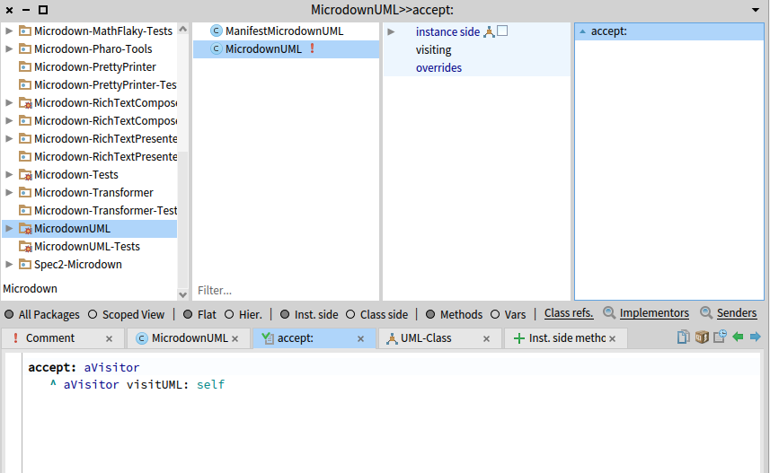
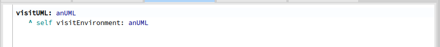

# Week 10

## Nawfel + Sofian

- Création du package MicrodownUML qui hérite de MicEnvironmentBloc

- Ajout de la méthode visitUML dans MicrodownVisitor

- Quelques tests + réflexion sur l'implémentation de PlantUML