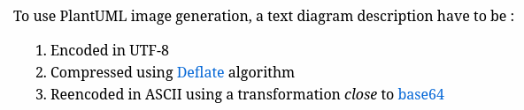

# Week 11

## Nawfel + Sofian

- Recherche d'une API proposé par PlantUML --> Aucune appel API n'est possible sans encodage du contenu

- Il semble qu'il faille encodé le contenu en UTF-8, le compresser à l'aide du [deflate algorithm](https://en.wikipedia.org/wiki/Deflate) puis le réencoder en ASCII afin de finalement effectuer l'appel API à l'aide de l'url suivant: //www.plantuml.com/plantuml/png/{contenuEncodé}

- On a donc dû rechercher un moyen d'encoder le contenu comme indiquer dans la documentation:

    Après quelques recherches nous avons trouver une personne qui a effectué cet encodage. Nous avons donc décidé de recupérer son mécanisme d'encodage afin de nous faire gagner du temps
    
    Lien du dépôt: https://github.dev/fuhrmanator/PlantUMLPharoGizmo

Lorsque nous avons essayé de rajouter les méthodes d'encodage, nous avons constaté qu'il y avait un problème au niveau de certaines fonctions car elle n'étaient plus présentes (le dépot contenait du code écrit sous Pharo 8)

Nous avons donc décidé de vous demander des renseignements sur cette méthode. Suite à votre réponse et au dépôt suivant (https://github.com/kasperosterbye/PlantUmlMicrodownExtension) que vous nous avez fourni nous avons pu récupérer les méthodes d'encodage sur Pharo 10. Nous en avons également profité pour analyser les différences entre ce que nous avions produit et ce qui avait été fait par kasperosterbye. Finalement il n'y avait que très peu de différence. Voici la liste des différences notées:

- Manière de packager l'extension. Nous avons plutôt opté pour un seul package contenant une classe avec toutes les méthodes d'encodage du contenu, et une classe contenant la fonction accept: permettant d'utiliser le Design Pattern Visitor. 

En effet il semblait plutôt clair (suite à notre analyse + notre discussion lors de la semaine 9) que l'implémentation de PlantUML allait se faire de la même manière que MicMathBlock. Le fait que kasperosterbye l'ai également implémenté de cette manière nous a conforté dans notre idée.

### Démarche suivi pour l'implémentation de PlantUML

- Créer un package Microdown-PlantUMLExtension
- Créer un package Microdown-PlantUMLExtension-Tests
- Créer une classe MicUMLBlock qui hérite de MicMathBlock
- Ajouter une méthode accept: dans la classe MicUMLBlock qui va appeler la méthode visitUML:
- Implémenter les méthodes permettant l'encodage du contenu + l'appel API dans une classe à part (PlantUMLEncoding)
- Implémenter la méthode visitUML: dans la classe MicrodownVisitor et dans MicRichTextComposer. Cette méthode va récupérer l'image via l'appel API

Une fois cela effectué, l'implémentation devrait être terminée

