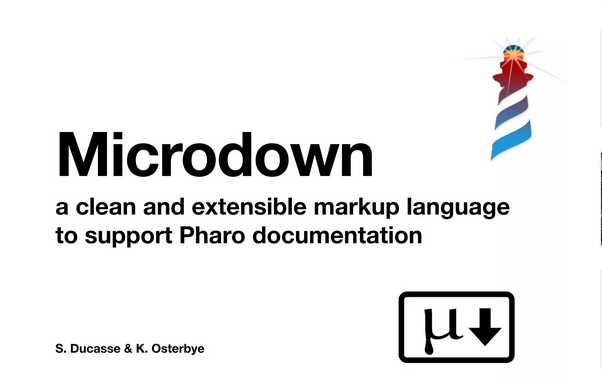

# Microdown

## Choix du Sujet

Implémentation de [PlantUML](https://plantuml.com/class-diagram) 

## Démarche suivi pour l'implémentation de PlantUML

- Créer un package Microdown-PlantUMLExtension
- Créer un package Microdown-PlantUMLExtension-Tests
- Créer une classe MicUMLBlock qui hérite de MicMathBlock
- Ajouter une méthode accept: dans la classe MicUMLBlock qui va appeler la méthode visitUML:
- Implémenter les méthodes permettant l'encodage du contenu + l'appel API dans une classe à part (PlantUMLEncoding)
- Implémenter la méthode visitUML: dans la classe MicrodownVisitor et dans MicRichTextComposer. Cette méthode va récupérer l'image via l'appel API
- Tester les différentes méthodes créées  

## Ce qu'il reste à faire

- Renforcer les tests
- Documenter les classes et packages

## Diaporama

Lien: https://www.canva.com/design/DAFT0MGlGPs/1uQQuDZcAZzeywrN2QvLfg/edit?utm_content=DAFT0MGlGPs&utm_campaign=designshare&utm_medium=link2&utm_source=sharebutton
